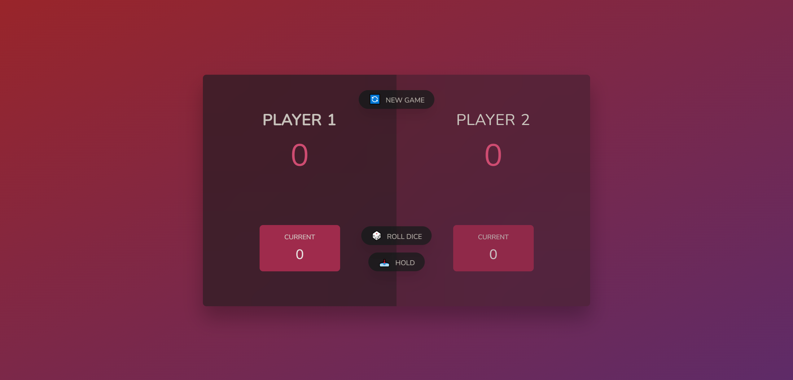

# Dice Game Website

This simple and addictive browser game allows players to take turns rolling a dice to reach a target score first. With a clean and minimalistic design, it provides a fun and engaging way to pass the time, perfect for casual gaming and practicing web development fundamentals.

[Take a live look at my website powered by ](link)



## Features

- Clean and minimalist design
- Multiplayer experience (2 players)
- Easy-to-understand game play
- Suitable for improving core web development skills

## Usage

### Prerequisites:

Clone the repository (GitBash):

- Insert this command in your GitBash:

```bash
git clone https://github.com/edg96/DiceGame
```

## A long advice

This project is an excellent opportunity to strengthen your skills in the key web development areas: HTML, CSS, and JavaScript.

- HTML forms the backbone of the webpage, structuring the game's content and interface.
- CSS handles the visual styling, providing a clean and responsive design for a smooth user experience.
- JavaScript introduces dynamic interactivity, controlling game logic, rolling dice, and managing player turns.

By working on this project, you'll gain hands-on experience building a fully functional web game using these essential technologies.
